# Agentic ML/Data Platform — Frontend and Backend Audit

**Audit date:** 2026-08-06  
**Scope:** `/Users/josiah/aug` platform monorepo, the current `apps/web` frontend, local API/provider-runtime implementation, and the supplied visual acceptance target at `/Users/josiah/Documents/frontend design/platform-focus-wireframe`.

## Current-run audit addendum — 2026-08-06

This addendum supersedes the earlier runtime observations where the repository had only generic or
gated surfaces. The older sections below remain useful as historical baseline, but the current
implementation now includes local SQL, notebooks, visualizations, pipelines, automations,
repositories, connector catalog/auth/discovery, local media transcription, update controls, and the
new execution adapters described here.

### 1. Audit scope and method

I reviewed the supplied audit, source contracts, capability generation, runtime composition, release
packaging, and the running React shell at `http://127.0.0.1:4173`. I captured the primary shell and
domain surfaces at a CSS viewport of 1280 × 720, then inspected DOM dimensions for overflow and
responsive behavior. The accepted screenshots are linked below; the first transient blank notebook
capture was rejected and replaced with `notebooks-fresh.png`.

### 2. User goal and accessibility target

The target is a single-product Spyderbyte workspace for solo developers, students, analysts, ML
researchers, game developers, content creators, privacy-sensitive users, and open-source maintainers.
The experience must make the next action obvious, keep local/private execution distinct from
external provider actions, preserve an inspectable artifact/lineage trail, and remain usable with
keyboard navigation and assistive technology. “Ready” means the executor and its authoritative
projection exist; a catalog card or generic resource record is not enough.

### 3. Current strengths

- The shell now presents Spyderbyte as the sole product. The sidebar, top bar, settings, updater
  copy, and desktop window title are aligned; no edition selector is shown.
- Global search is an actual command palette, not a decorative input. It searches platform surfaces,
  projects, runs, connections, datasets, queries, notebooks, pipelines, automations, repositories,
  and visualizations, supports keyboard arrows/Enter/Escape, and focuses its input on open.
- Notifications are now derived from the runtime subscription stream, persisted locally, de-duplicated,
  marked read/dismissed, and linked back to the relevant surface. The empty state is explicit rather
  than claiming the feature is disabled.
- SQL Workbench, Notebook Workbench, Visualization Builder, Pipeline Builder, Connections, Media,
  Repositories, and Settings use specialized copy and existing design-system primitives rather than
  introducing a parallel UI layer.
- The new adapter boundaries are truthful: Meltano, provider actions, signed local bridges, training,
  and serving report unavailable until their configured executors and signed inputs exist.
- The shell has no document-level horizontal overflow at the audited viewport. The sidebar measured
  224 px, the top bar 56 px, and the content region 1,056 px; the page uses `min-width: 0` and
  responsive two-column form/card grids that collapse on narrow screens.

### 4. UX risks found and addressed

1. **Search looked non-functional.** Addressed with the global palette, real result indexing, focus,
   keyboard navigation, and Escape dismissal. Remaining work is ranking/fuzzy matching and opening
   resource-specific detail routes instead of the collection route with a query parameter.
2. **Notifications claimed to be disabled.** Addressed with subscription-backed notifications,
   unread count, mark-all-read, dismiss, and empty-state copy. A future pass should add server-side
   notification projection history for multi-window synchronization; the current desktop behavior is
   intentionally local-first.
3. **Cards and forms were visually oversized or under-constrained.** Addressed by constraining
   page headings, wrapping long identifiers, adding `min-width: 0`, using two-column editor grids at
   desktop widths, collapsing to one column below 840/560 px, and reducing the four-action Home row
   to a 2 × 2 grid.
4. **Unavailable states could appear after a generic loading shell.** Specialized surfaces now name
   the missing executor and remediation. Deployment serving intentionally remains visible as a setup
   surface so a user can see the required `SPYDERBYTE_SERVE_COMMAND` rather than encountering a
   dead-end generic resource page.
5. **Connector cards could imply more than metadata.** The catalog displays operation lists,
   digest/signature metadata, setup requirements, discovery, and runtime state. Meltano extraction,
   cloud actions, and local bridges are separate adapter families so “tap” is not presented as a
   video-editing API.

### 5. Accessibility review

- Search and notifications are keyboard reachable buttons with accessible names, expanded state, and
  dialog semantics. The search input receives focus when the palette opens; Escape closes it.
- Buttons use the existing minimum touch target and semantic status primitives. Responsive grids avoid
  forcing horizontal scrolling at the audited width.
- Long IDs, hashes, SQL, paths, and provider messages now wrap or live in bounded text areas instead
  of expanding a card indefinitely.
- Still required before release: automated browser focus-order checks, screen-reader traversal of
  the command palette/notification dialog, reduced-motion verification, and keyboard-only runs for
  OAuth callback, notebook cells, connector discovery, repository writes, and deployment rollback.

### 6. Requested execution gap status

| Area                   | Current implementation                                                                                                                                                                                                                                | Honest boundary                                                                                                                                                                           |
| ---------------------- | ----------------------------------------------------------------------------------------------------------------------------------------------------------------------------------------------------------------------------------------------------- | ----------------------------------------------------------------------------------------------------------------------------------------------------------------------------------------- |
| Signed Meltano         | `SPYDERBYTE_MELTANO_BIN`, digest manifest, detached-signature verification, bundled Tauri resource preparation, stream discovery, checkpoints, artifacts, cancellation, and release gates.                                                            | No Meltano executable was present in this workspace, so live tap execution is not claimed. Production packaging requires the binary, public key, and signature inputs.                    |
| Cloud provider actions | Scoped OAuth action runtime for GitHub repositories/PR/merge, Google Drive listing, Slack messaging, YouTube channel listing, and Frame.io project listing.                                                                                           | Provider OAuth apps, scopes, accounts, and live API responses must be supplied/configured; media upload/render APIs need provider-specific credentials and additional multipart adapters. |
| Local media bridges    | Signed JSON-over-stdio contract for Premiere, Resolve, Final Cut, and a generic media bridge; explicit project/timeline/import/render/observe/export/publish operations; bundle preparation and signature verification.                               | The bridge executables and their application-specific implementations are external release artifacts and are not fabricated by the repository.                                            |
| Git writes             | Registered-repository commit, push, GitHub pull request creation, and merge operations with explicit UI controls and provider-action authorization.                                                                                                   | Push/PR/merge are effectful and require user approval, remote access, and a connected GitHub account.                                                                                     |
| Model serving          | Configured local serving command, persistent deployment records, loopback health checks, canary traffic, promotion, and rollback.                                                                                                                     | `SPYDERBYTE_SERVE_COMMAND` and a compatible serving process are required; no fake serving readiness is reported.                                                                          |
| Automations            | Manual/interval/webhook/event triggers, HMAC webhook verification, event dispatch, bounded backfills, queue/reject concurrency policies, persisted runs, pause/resume.                                                                                | A production webhook ingress and secret provisioning policy are still deployment configuration, not hard-coded credentials.                                                               |
| Updates                | Tauri updater config generation, templated production endpoint handling, concrete artifact-base validation, signed public-key requirements, manifest signing helper, background/native check/install flow, workspace preservation and rollback hooks. | A real production endpoint, artifact host, and private release key cannot be safely invented in source. Release checks now fail closed until the owner supplies them.                     |

### 7. Current browser evidence

- 
- 
- 
- 
- 
- 
- 
- 
- 
- 
- 
- 
- 
- 

### 8. Recommendations and next surfaces

The next design-system surfaces should stay inside the existing `Layout`/`Sidebar`/`TopBar` shell:

- Connector detail/setup: permissions, account/resource picker, discovery, health, run history,
  reauthorization, and digest/signature state.
- Data Catalog/stream selection: schema preview, PII policy, incremental cursor, and lineage.
- Repository review: diff/check/commit/push/PR/merge in a staged action panel with explicit approval.
- Deployment detail: process state, health history, traffic timeline, canary decision, rollback.
- Media project: cloud action vs signed local bridge clearly separated, with render progress and
  immutable output artifacts.
- Update and diagnostics: endpoint/key status, signed manifest digest, download/install/rollback
  state, and a safe workspace backup checkpoint.

Do not add another visual language. Continue using `Button`, `Card`, `Drawer`, `Field`, `Input`,
`Select`, `Textarea`, `SearchInput`, `Badge`, `Progress`, `DataTable`, and `Pagination`, with the
existing semantic tones, spacing, typography, and motion tokens.

### 9. Evidence limits

The browser run proves the shell, navigation, sizing, search, notification presentation, and
specialized surfaces render. It does not prove live provider API calls, a real Meltano tap, proprietary
editor automation, a real model server, production webhook ingress, or a signed release update.
Those require external binaries, OAuth apps/accounts, provider scopes, bridge packages, a serving
command, and release infrastructure. The implementation now makes those dependencies explicit and
fail-closed.

## Historical baseline from the supplied audit

The sections below preserve the original audit evidence and recommendations from before the
current implementation pass. Where they describe SQL, notebooks, visualizations, pipelines,
automations, repositories, connectors, media, or deployments as generic or missing, use the
current-run addendum above as the updated status. Remaining gaps in that addendum are intentional
release/configuration boundaries, not hidden placeholder capability.

## Executive verdict (historical baseline)

The platform has a credible local-first foundation, but it is not yet a complete agent + machine-learning/data product. The strongest work is in contracts, local workspace/artifact persistence, policy/approval controls, resource/capacity inspection, model-provider abstractions, Hugging Face model download plumbing, and the local dataset vertical slice. The largest gaps are the last mile between those contracts and a trustworthy product experience: real provider execution, a user-facing fine-tuning workflow, a generic API-key surface, a real visualization renderer, connector execution, notebook/training/serving adapters, and a clean first-run setup journey. There is also no first-run tutorial, replayable tour, or persistent onboarding state today; the existing Toast primitive is useful for feedback but is not an onboarding system. The current dollar-budget framing is a product-model mismatch for a locally licensed, non-metered application and should be replaced by entitlements, capacity, and optional external-spend controls.

The short answers to the questions that prompted this audit are:

| Question                                                  | Answer                                                                                                                                                                                                                                                                                                                                                        |
| --------------------------------------------------------- | ------------------------------------------------------------------------------------------------------------------------------------------------------------------------------------------------------------------------------------------------------------------------------------------------------------------------------------------------------------- |
| Can users download a model for local provider use?        | **Partially yes.** The Models screen and backend implement Hugging Face search, revision inspection, pinned commit selection, GGUF/MLX filtering, download progress/cancel, atomic installation, runtime registration, and removal. It is currently gated in the default/mock runtime and was not verified end-to-end against a live local inference backend. |
| Can users download a model for fine-tuning?               | **Not end-to-end.** Local training contracts and checkpoint/lineage logic exist, but `models.train` is explicitly unavailable by default and there is no specialized frontend for dataset selection, training configuration, hardware allocation, evaluation, or publication.                                                                                 |
| Is OpenAI Codex / Claude Code easy to connect?            | **The backend shape is there; the product path is not yet easy.** Both providers are in the catalog and routing priority, but use CLI/subscription authentication rather than a simple key form. The current runtime was blocked before these surfaces could be used, and the default provider transports/CLI runner are optional configuration.              |
| Is there a user-facing place to enter their own API key?  | **No, not as a standard platform feature.** There is a secure vault foundation and a Hugging Face token field, plus connector-specific secret fields, but no generic “Provider credentials / API keys” surface and no actual OpenAI/Anthropic BYO-key connector in the curated catalog.                                                                       |
| Is visualization implemented?                             | **No, beyond presentation scaffolding.** The route, resource commands, and design concept exist, but the backend explicitly reports that the authoritative renderer is not installed and the frontend route is a generic CRUD resource page.                                                                                                                  |
| Is there a guided, skippable, replayable onboarding tour? | **No.** The current Home objective flow is a starting point, but no first-run state machine, tour steps, replay action, or progress persistence was found.                                                                                                                                                                                                    |
| How good is it for local ML and data analysis?            | **Data foundation: promising and partially usable. Local ML: incomplete.** Deterministic local ingestion, profiling, validation, artifacts, lineage, and policy are stronger than the end-to-end training, notebook, visualization, serving, and real-provider paths.                                                                                         |

Overall readiness: **foundation / pre-production**, not release-ready as an integrated agentic ML/data platform.

## 1. Audit method and evidence

I reviewed source, route registration, capability manifests, local API/provider-runtime contracts, implementation-plan status, automated checks, and current-run browser evidence. The current-run evidence is important because the repository contains design-QA notes that say “passed,” while the current runtime and the implementation plan show unresolved release gates.

### Current-run runtime evidence

1. The managed runtime was first attempted with the real local daemon. The default workspace hit a SQLite `database is locked` migration failure.
2. An isolated workspace avoided the lock but failed during curated connector-registry verification: `meltano-tap-postgres failed curated registry verification`.
3. The frontend was then run in explicit mock mode. It connected, but only `projects`, `runs`, run projections, and machine state were enabled. Models, Connections, Visualizations, Data, SQL, Notebooks, Experiments, Deployments, and most other surfaces rendered as unavailable.
4. The supplied wireframe repository ran successfully and was captured as the visual target. It is a polished static product concept, not a connected runtime.

### Verification completed

- `pnpm --filter @agentic-platform/web audit:design-system` — passed.
- `pnpm --filter @agentic-platform/web test` — 3 files, 41 tests passed.
- `pnpm --filter @agentic-platform/web typecheck` — passed.
- `pnpm --filter @agentic-platform/web build` — passed.
- `@agentic-platform/provider-runtime` — 14 tests passed.
- `@agentic-platform/local-daemon` — 5 tests passed.
- `@agentic-platform/orchestrator` — 15 tests passed.
- `@agentic-platform/backends` — 28 tests passed.
- `@agentic-platform/local-api` — no test files were found by its package test command.

These checks establish that the code compiles and important local contracts are tested. They do not prove that a clean user can configure a provider, run a real model, fine-tune, render a chart, or publish a served model. The implementation plan itself lists full browser accessibility/E2E, real provider/model execution, serving, and several clean-machine release gates as open.

## 2. Complete feature checklist

Status labels:

- **Ready foundation** — materially implemented and test-backed, usually local-only.
- **Partial** — contracts or a vertical slice exist, but the product journey or production adapter is incomplete.
- **Gated** — UI exists but current capability state does not make it usable.
- **Generic/stub** — route and CRUD shell exist without domain-specific behavior.
- **Missing** — no usable end-to-end implementation found.
- **Blocked** — current runtime prevented validation or exposed a release-blocking defect.

### A. Agent workspace and workflow control

| Standard feature                       | Frontend state                                                                                                                                                                                          | Backend state                                                                                                                                            | Gap / priority                                                                                                                                 |
| -------------------------------------- | ------------------------------------------------------------------------------------------------------------------------------------------------------------------------------------------------------- | -------------------------------------------------------------------------------------------------------------------------------------------------------- | ---------------------------------------------------------------------------------------------------------------------------------------------- |
| First-run onboarding                   | **Missing as a tutorial.** Home has an objective composer, but no guided walkthrough, skip/replay controls, progress state, or reliable provider/license/workspace setup sequence in the current shell. | **Partial.** Local license, workspace, session, and API routes exist, but no onboarding-progress contract was found.                                     | Make first run a guided state machine: license → workspace → provider → data → objective, with persistent progress and recovery states. **P0** |
| Project creation and objective capture | **Partial.** Home has a real objective input; Projects still uses a browser `prompt` for “New project.”                                                                                                 | **Ready foundation.** `CreateProject` and project projections exist.                                                                                     | Replace `prompt` with an accessible form/drawer and connect it to the target project workbench. **P1**                                         |
| Agent conversation                     | **Partial.** Project detail includes conversation, streaming state, stop-agent, and send controls.                                                                                                      | **Partial.** Durable conversation service, provider routing, cancellation, tool activity, and optional Cline adapter exist.                              | Real provider transport is still required for a production response. **P0**                                                                    |
| Plan generation                        | **Partial.** Project detail has a Plan tab and step state.                                                                                                                                              | **Ready foundation.** Typed plans, authority envelopes, policy decisions, approvals, and plan/run routes exist.                                          | First-run plan review is not consistently reachable from the target shell. **P1**                                                              |
| Approval review                        | **Partial.** Approval screen and plan-review primitives exist; many routes are gated in mock mode.                                                                                                      | **Ready foundation.** Exact action-digest binding, commit-time revalidation, approval states, and audit coverage are strong.                             | Make approval a visible step in every high-impact model/data/publish flow. **P1**                                                              |
| Live run execution                     | **Partial.** Runs, run detail, progress, logs, metrics, cancel, and timeline surfaces exist.                                                                                                            | **Partial / local-only.** Durable internal engine, recovery, cancellation, SSE, and local subprocess work exist; Temporal/hosted execution remains open. | Validate against a clean daemon and real provider, not only deterministic/local fixtures. **P0**                                               |
| Agent decisions and human judgment     | **Partial.** The supplied wireframe has Guide / Plan / Tasks / Conversation / Decisions. Current app has Conversation / Plan / Activity but not the same contextual model.                              | **Partial.** Decision records and policy/audit contracts exist.                                                                                          | Unify these surfaces around one workflow truth model. **P1**                                                                                   |
| Run history and observability          | **Partial.** Run timeline, metrics, logs, status, and footer state are represented.                                                                                                                     | **Ready foundation.** Projections, events, cursor replay, redelivery, and audit records are implemented locally.                                         | Add useful filtering, drill-down, failure diagnosis, and notifications. **P1**                                                                 |
| Cancellation and recovery              | **Partial.** Cancel project/run and retry affordances exist.                                                                                                                                            | **Ready foundation / local.** Cancellation propagation, retry ownership, restart recovery, and process replacement tests exist.                          | Clean-machine daemon crash/restart evidence remains open. **P1**                                                                               |

### B. Model providers and model lifecycle

| Standard feature                            | Frontend state                                                                                                                                                 | Backend state                                                                                                                                                                                     | Gap / priority                                                                                                                                                 |
| ------------------------------------------- | -------------------------------------------------------------------------------------------------------------------------------------------------------------- | ------------------------------------------------------------------------------------------------------------------------------------------------------------------------------------------------- | -------------------------------------------------------------------------------------------------------------------------------------------------------------- |
| Provider catalog                            | **Partial / gated.** Models screen shows readiness, model ID, billing, auth state, capabilities, context window, quota, and runtime requirements when enabled. | **Ready foundation.** Default catalog contains OpenAI Codex, Claude Code, Hugging Face local, and deterministic providers.                                                                        | Provider catalog is not available in current mock mode and was blocked in the real runtime. **P0**                                                             |
| Routing and fallback                        | **Partial.** Models and Settings expose priority, external-provider policy, fallback, and allowed data classes.                                                | **Ready foundation.** Provider priority, task shapes, tiers, model selection, policy checks, and fallback are implemented.                                                                        | Make the policy understandable to non-operators and show the selected provider per run. **P1**                                                                 |
| Hugging Face search                         | **Implemented in UI.** Search-as-you-type, combobox/listbox keyboard navigation, private/public metadata, and selection exist.                                 | **Implemented.** Search and token-aware Hub client routes exist.                                                                                                                                  | Needs live runtime verification and rate/error states. **P1**                                                                                                  |
| Repository detail and reproducible revision | **Implemented in UI.** Inspect, license, files, formats, branch/tag, and pinned commit SHA are shown.                                                          | **Implemented.** Details endpoint and revision handling exist.                                                                                                                                    | Add provenance/checksum, model-card risk, license acceptance, and disk-size visibility. **P1**                                                                 |
| Download for local provider use             | **Partial but strongest model feature.** Confirmation dialog, GGUF/MLX support messaging, progress, cancel, installed list, and remove are present.            | **Partial / local-only.** Download manager, `.agentic/models` cache, atomic installation, runtime discovery, and OpenAI-compatible local transport registration exist.                            | Verify a real downloaded model boots and serves a request through a supported runtime. **P0**                                                                  |
| Runtime compatibility                       | **Partial.** On-device backend status is displayed; GGUF/llama.cpp and MLX/Apple Silicon are named.                                                            | **Partial.** Local runtime registry detects format and endpoint; readiness depends on an installed backend.                                                                                       | Add explicit install/remediation for missing runtime, GPU/Metal/CPU capacity, and model memory fit. **P1**                                                     |
| Model cache management                      | **Partial.** Installed models can be removed; active downloads can be cancelled.                                                                               | **Partial.** Download manager and installed-model listing exist.                                                                                                                                  | Add disk usage, cache location, resume/retry, checksum, eviction, and import-from-local-file. **P2**                                                           |
| Fine-tuning / training                      | **Missing end-to-end.** Experiments is a generic resource page; no training form or base-model → dataset → recipe → run flow.                                  | **Partial / local vertical slice.** Candidate configs, local subprocess jobs, budget metering, checkpoints, and lineage summaries exist, but `models.train` is explicitly unavailable by default. | Build a real training contract and screen with dataset version, base model, method, hyperparameters, compute, eval, approval, and artifact publication. **P0** |
| Experiment tracking                         | **Generic/stub.** Experiments page only maps to CRUD resource configuration.                                                                                   | **Partial.** Local experiment persistence and provider-neutral adapters exist; production tracker remains open.                                                                                   | Add comparison tables, metrics, artifacts, source revision, environment, and reproducibility details. **P1**                                                   |
| Evaluation and promotion                    | **Generic/stub.** No specialized evaluation or promotion UI.                                                                                                   | **Partial.** Evaluation, immutable promotion, approval binding, canary rollback, and lifecycle audit are composed locally.                                                                        | Surface eval gates, model lineage, approval, and rollback in the product. **P1**                                                                               |
| Serving / deployment                        | **Generic/stub.** Deployments is a CRUD resource page.                                                                                                         | **Missing adapter.** `deployments.serve` is explicitly unavailable; production serving remains open.                                                                                              | Add serving runtime, endpoint health, traffic, canary, rollback, and cost surfaces. **P0**                                                                     |

### C. OpenAI Codex and Claude Code integrations

| Standard feature            | Frontend state                                                                                                             | Backend state                                                                                                                                       | Gap / priority                                                                                     |
| --------------------------- | -------------------------------------------------------------------------------------------------------------------------- | --------------------------------------------------------------------------------------------------------------------------------------------------- | -------------------------------------------------------------------------------------------------- |
| Discover Codex and Claude   | **Partial.** Connections catalog categorizes model subscriptions; Models and Settings show provider priority.              | **Implemented as catalog entries.** `openai-codex` and `claude-code` are registered with model resources and streaming/agent-assistance operations. | Make provider setup visible from first-run and AI workspace, not only from a gated catalog. **P0** |
| Authentication flow         | **Partial.** Selected model connector shows “Start supported sign-in”; non-CLI OAuth connectors show “Connect in browser.” | **Partial.** Codex uses `cline auth --provider openai-codex`; Claude uses `claude`; CLI auth requires an injected/configured runner.                | Add a clear preflight for installed CLI, version, path, signed-in state, and next action. **P1**   |
| Provider readiness          | **Partial.** Provider cards can show `ready`, `degraded`, or `unconfigured`.                                               | **Partial.** Providers are cataloged, but transport is only supplied when `codexTransport`, `claudeTransport`, or a Cline gateway is injected.      | Treat “registered” and “callable” as different states, with actionable remediation. **P0**         |
| Provider selection in a run | **Partial.** Routing priority is editable, but the main workbench does not clearly expose the selected model per step.     | **Ready foundation.** Model router and policy-constrained selection exist.                                                                          | Show selected provider/model, data class, fallback reason, usage, and cost in run detail. **P1**   |
| Data handling policy        | **Partial.** Settings has external-provider and allowed-data-class controls.                                               | **Ready foundation.** Routing policy and allowed classes are enforced in model selection.                                                           | Make the consequence of sending confidential/restricted data explicit before execution. **P1**     |

### D. User API keys and secrets

| Standard feature                     | Frontend state                                                                                                         | Backend state                                                                                                                                                                     | Gap / priority                                                                                                      |
| ------------------------------------ | ---------------------------------------------------------------------------------------------------------------------- | --------------------------------------------------------------------------------------------------------------------------------------------------------------------------------- | ------------------------------------------------------------------------------------------------------------------- |
| Generic “bring your own key” entry   | **Missing.** No provider-agnostic API-key screen in Settings, Models, Connections, or the wireframe.                   | **Partial foundation.** Generic `storeSecret` exists internally; actual curated connectors expose OAuth, CLI, form, or local bridge modes, not an OpenAI/Anthropic key connector. | Add a first-class credential center. **P0**                                                                         |
| Hugging Face token                   | **Implemented.** Password input and “Save token” action exist on Models.                                               | **Implemented.** Token is stored as `secret:huggingface-token` and loaded into the Hub client.                                                                                    | Move this into a unified credentials surface while keeping model-specific context. **P1**                           |
| Connector-specific secrets           | **Partial.** Form connectors can render secret fields as password inputs.                                              | **Implemented foundation.** Connection configuration is stored in the credential vault; metadata excludes tokens.                                                                 | Add scope, test, rotate, revoke, expiration, and audit UX. **P1**                                                   |
| Secure storage                       | **Ready foundation / platform-dependent.** UI copy promises broker handles and no credential entry into agent context. | **Partial.** macOS uses Keychain when enabled; non-macOS or disabled mode falls back to memory; provider-secret Keychain adapters remain an open release gate.                    | Make storage location and persistence guarantees visible; fail loudly when only memory storage is available. **P0** |
| Secret redaction and agent isolation | **Not directly visible.**                                                                                              | **Ready foundation.** Redaction, authority, tool grants, and “tokens never enter agent context” contracts/tests exist.                                                            | Add inspectable audit evidence without revealing values. **P1**                                                     |

### E. Data, SQL, notebooks, pipelines, and automation

| Standard feature            | Frontend state                                                                                                                                    | Backend state                                                                                                                                                                  | Gap / priority                                                                                                              |
| --------------------------- | ------------------------------------------------------------------------------------------------------------------------------------------------- | ------------------------------------------------------------------------------------------------------------------------------------------------------------------------------ | --------------------------------------------------------------------------------------------------------------------------- |
| Local dataset import        | **Partial / gated.** Data uses a generic resource page with CSV import and stage/import action.                                                   | **Ready local vertical slice.** CSV/JSON profiling, schema/type checks, PII governance, duplicate/split-leakage detection, immutable artifacts, and validation workflow exist. | Present data as versioned objects with preview, schema, quality, lineage, usage, and agent context as in the target. **P1** |
| Catalog and lineage         | **Generic/stub.** Catalog is a generic table; no visual lineage explorer in current shell.                                                        | **Ready foundation.** CAS artifacts, immutable versions, lineage records, and catalog projections exist.                                                                       | Bring lineage into the main workbench and connect every report/chart/model to source versions. **P1**                       |
| SQL workbench               | **Partial.** SQLWorkbench is richer than most generic pages and includes import, validate, execute/cancel, result artifact, and lineage concepts. | **Ready local.** Local SQL runtime is the one execution capability marked ready when provider runtime is loaded.                                                               | Connect SQL results to real visualizations and analysis objects. **P1**                                                     |
| Notebook execution          | **Generic/stub.** Notebook page is a configurable editor/list.                                                                                    | **Missing adapter.** `notebooks.execute` says the local Python kernel is not installed.                                                                                        | Add kernel lifecycle, environment selection, logs, cancellation, and artifact capture. **P1**                               |
| Experiments                 | **Generic/stub.** CRUD only.                                                                                                                      | **Partial local lifecycle.** Experiment persistence and lineage contracts exist.                                                                                               | Add run comparison, metrics, charts, model/config/source links, and approval state. **P1**                                  |
| Pipelines                   | **Generic/stub.** CRUD with Run/Cancel actions.                                                                                                   | **Missing adapter.** `pipelines.execute` is explicitly unavailable.                                                                                                            | Add graph editor, dependency state, retries, artifacts, and run history. **P1**                                             |
| Automations                 | **Generic/stub.** CRUD with pause/resume.                                                                                                         | **Missing adapter.** Durable scheduler is explicitly unavailable.                                                                                                              | Add schedule/trigger editor, preview, timezone, run history, and failure policy. **P2**                                     |
| Code/repositories/worktrees | **Generic/stub.** Routes are mostly ResourcePage wrappers.                                                                                        | **Partial.** Coding sandbox and repository/worktree contracts exist; repository sync remains unavailable.                                                                      | Add a real code surface only after sync/execution boundaries are stable. **P2**                                             |

### F. Visualization and reporting

| Standard feature            | Frontend state                                                                                                                                                                             | Backend state                                                                                     | Gap / priority                                                                                                                             |
| --------------------------- | ------------------------------------------------------------------------------------------------------------------------------------------------------------------------------------------ | ------------------------------------------------------------------------------------------------- | ------------------------------------------------------------------------------------------------------------------------------------------ |
| Visualization route         | **Gated/generic.** `Visualizations.tsx` delegates to ResourcePage and only advertises refreshable charts.                                                                                  | **Contract exists.** Create/update/archive/refresh commands and projection names exist.           | A route is not a renderer. **P0**                                                                                                          |
| Chart rendering             | **Missing in production surface.** No specialized chart grammar or chart canvas in `apps/web`.                                                                                             | **Missing.** `visualizations.render` explicitly says the authoritative renderer is not installed. | Implement a governed renderer with chart spec, query binding, versioning, deterministic output, and export. **P0**                         |
| Data binding and provenance | **Static target only.** The wireframe shows a chart linked to `Query:v4` and `Customers:v18`.                                                                                              | **Partial foundation.** Artifact and lineage contracts can support this.                          | Make source query, dataset/model version, filters, assumptions, and freshness inspectable. **P1**                                          |
| Report/evidence experience  | **Target is strong but static.** The wireframe shows findings, confidence, recommendations, assumptions, evidence, and versions. Current app lacks a comparable specialized report object. | **Partial.** Report/artifact/lineage contracts exist.                                             | Make evidence-backed reports a first-class object, not a generic resource row. **P1**                                                      |
| Accessibility and export    | **Not verified end-to-end.** No chart-specific keyboard/table alternative was found.                                                                                                       | **Not established.**                                                                              | Require keyboard navigation, accessible data tables, alt text/description, CSV/PNG/SVG/export policy, and reproducible chart specs. **P1** |

### G. Integrations and connectors

| Standard feature                  | Frontend state                                                                                                               | Backend state                                                                                                 | Gap / priority                                                                         |
| --------------------------------- | ---------------------------------------------------------------------------------------------------------------------------- | ------------------------------------------------------------------------------------------------------------- | -------------------------------------------------------------------------------------- |
| Searchable connector catalog      | **Implemented in source, gated at runtime.** Search, category filter, pagination, setup badges, and connector details exist. | **Partial.** Curated registry and catalog routes exist, but current boot failed registry verification.        | Fix registry verification before relying on catalog. **P0**                            |
| OAuth/CLI/form/local-bridge setup | **Partial.** Drawer supports secure forms, signed local bridge, browser OAuth, and supported CLI sign-in.                    | **Partial.** OAuth PKCE, CLI flow, managed connection, refresh, revoke, and Keychain vault exist.             | Add clean setup, error, retry, expiration, and reauthorization states. **P1**          |
| Resource discovery                | **Implemented in source.** “Discover resources” action exists.                                                               | **Ready when provider runtime is loaded.** Connector discovery is marked ready.                               | Validate with real connectors and show scope/resource grants. **P1**                   |
| Connector execution               | **No usable workflow surface.**                                                                                              | **Missing adapter.** `connectors.execute` explicitly unavailable.                                             | Add signed execution adapter, scoped operations, retries, redaction, and audit. **P0** |
| Connector governance              | **Generic/stub.** Governance/Audit pages lack specialized connector publication views.                                       | **Partial local.** Connector schema/source/test/package, scans, approval digest, revocation, and audit exist. | Surface connector trust, version, operations, scopes, and revocation visibly. **P1**   |

### H. Governance, security, tenancy, and operations

| Standard feature      | Frontend state                                                                                       | Backend state                                                                                                                                      | Gap / priority                                                                                       |
| --------------------- | ---------------------------------------------------------------------------------------------------- | -------------------------------------------------------------------------------------------------------------------------------------------------- | ---------------------------------------------------------------------------------------------------- |
| Policy controls       | **Partial.** Settings exposes external providers, fallback, and data classes. Governance is generic. | **Ready foundation.** Typed policy, authority envelopes, scoped resources, revocation epochs, approvals, and budget enforcement are strong.        | Make policy decisions explainable at the point of action. **P1**                                     |
| Audit trail           | **Generic/stub.** Audit route exists but is a generic resource view.                                 | **Ready local foundation.** Append-only/hash-chained audit and lifecycle records exist.                                                            | Add filters, actor/provider/resource scope, action digest, and export. **P1**                        |
| Workspace persistence | **Partial.** Settings exposes export, backup, restore preview, and import.                           | **Ready local foundation.** Portable SQLite/CAS archive, checksums, integrity/path validation, and non-overwriting restore exist.                  | Test the full UI journey on a clean machine and make path selection safer. **P1**                    |
| License               | **Partial.** License page exists; mock mode reports an explicit mock license.                        | **Ready foundation / release work open.** Fail-closed Ed25519 validation and effectful-command gating exist.                                       | Complete signed-license embedding, clean-machine, offline, and Gatekeeper evidence. **P0**           |
| Compute and capacity  | **Partial.** Home/sidebar exposes CPU, memory, storage, and GPU status. Compute page exists.         | **Partial local.** CPU/RAM/GPU inventory, offers, allocation, subprocess jobs, cost metering, and OOM handling exist; hosted compute remains open. | Turn capacity into actionable preflight for download/training/run. **P1**                            |
| Cost and quotas       | **Partial.** Provider cards can show quota and reset information.                                    | **Ready foundation/local.** Budget reservations and usage/cost observations exist.                                                                 | Surface forecast, actual, local-vs-external cost, and hard-stop behavior in runs. **P1**             |
| Health/reconnect      | **Partial.** Banner, retry, footer status, and capability states exist.                              | **Partial.** Health/session/capability/SSE routes exist.                                                                                           | Current failures need actionable diagnosis, log path, reset/isolation guidance, and recovery. **P0** |
| Hosted deployment     | **Missing for product use.** Pages exist as generic route shells.                                    | **Deferred.** Hosted PostgreSQL/S3/NATS/cloud scheduler/secret manager/worker pools/backup remain deferred.                                        | Keep local-first scope explicit; do not imply hosted readiness in navigation. **P1**                 |

## 3. Model download versus fine-tuning: the precise gap

### What is already good

The model-management implementation is one of the most mature frontend/backend pairings in the repository. It has a coherent local-provider path:

1. Search Hugging Face.
2. Inspect repository metadata and license.
3. Choose branch/tag or pinned commit SHA.
4. Refuse download when no supported GGUF/MLX file is detected.
5. Confirm license, format, revision type, disk/backend checks.
6. Download into a managed cache.
7. Show progress and allow cancellation.
8. Detect installed model and local runtime compatibility.
9. Register the local model as a provider when an endpoint is ready.
10. Remove installed models.

That is enough to say the platform has a **promising local model-provider foundation**. It is not enough to call it a complete model lifecycle because the live runtime path was not verified and the current capability state hides the screen.

### What is missing for fine-tuning

Fine-tuning requires a separate workflow, not just a download button. The platform needs:

- base-model selection and immutable model revision;
- dataset selection with version, schema, PII policy, and split/leakage checks;
- training method (for example full fine-tune, LoRA/QLoRA, adapter, distillation);
- hyperparameters and reproducible configuration;
- CPU/GPU/Metal memory preflight and allocation;
- queueing, cancellation, retry, logs, checkpoints, and resume;
- evaluation dataset, metrics, baseline, and acceptance thresholds;
- artifact/model registry publication with lineage to model, data, code, environment, and run;
- approval before promotion;
- local serving or export format selection;
- rollback and comparison against the base model.

The repository has pieces of this in backend contracts and local orchestration, but the default capability manifest explicitly marks `models.train` unavailable and no dedicated UI flow was found. The current answer is therefore: **download for inference is partial; fine-tuning is a backend foundation without a usable product journey.**

## 4. Onboarding and tutorial assessment

### Verdict

The platform currently has **no first-run tutorial, walkthrough, replayable tour, or persistent onboarding state**. Home can accept an objective and route quick actions, but that is a starting action, not an explanation of the platform. Source inspection found Tooltip and Toast primitives, but no tutorial controller, tour-step registry, progress model, or replay entry point. The wireframe only uses a transient toast for action feedback.

That means a new user is asked to infer a large system from a broad navigation tree. This is especially risky because the platform exposes several different mental models at once: agent workspace, data objects, model/provider setup, local compute, governance, connectors, experiments, deployments, and operations.

### What Toast is good for—and what it is not

Toast should be a supporting layer, not the tutorial itself.

Good Toast uses:

- confirming that a step completed, such as “Dataset profiled” or “Provider test succeeded”;
- reporting a non-blocking background event, such as download progress completion;
- pointing to a durable destination, such as “Open run details.”

Poor Toast uses:

- explaining where a control is located;
- teaching a multi-step workflow;
- displaying instructions long enough for a new user to read and act on;
- preserving context after navigation, reload, or interruption;
- communicating a spatial relationship between the project pane, workbench, and agent panel.

The current primitive is a short `role="status"` notification with optional dismiss behavior, which is appropriate for feedback but has no target anchoring, progress, step navigation, persistence, or focus-management contract ([Toast and Tooltip primitives](/Users/josiah/aug/apps/web/src/components/primitives.tsx:659)).

### Recommended tutorial experience

Use a **skippable, replayable guided tour** composed of anchored popovers/spotlights plus a persistent “Getting started” side panel. Use Toast only to acknowledge progress. The tour should point at the real controls and invoke the real commands so that completing the tour also proves the environment is usable.

1. **Orient the user** — Show the primary rail, project/resource pane, main workbench, and contextual agent panel. **Health: missing today.**
2. **Set up workspace and privacy** — Explain local runtime, workspace scope, backup/restore, data classes, and what may leave the machine. **Health: partial; settings and policy controls exist, but there is no guided sequence.**
3. **Bring in data** — Import a CSV/JSON or choose a connection, then show version, schema, profile, quality, lineage, and PII warnings. **Health: backend foundation good; current UI is generic/gated.**
4. **Create an objective and inspect the plan** — Use the Home objective composer, then show Guide, Plan, Tasks, Conversation, Decisions, approvals, and activity. **Health: partial; objective and project plan surfaces exist, but are not taught as one loop.**
5. **Run safely** — Explain provider/model selection, data-class policy, approval, logs, cancellation, resource usage, optional external spend, and artifact publication. **Health: partial; contracts exist, real provider execution remains open.**
6. **Choose a model path** — Compare Codex, Claude Code, and local Hugging Face models; explain CLI/API-key auth, local runtime requirements, and fallback behavior. **Health: gated/blocked in the current runtime.**
7. **Review outputs and replay** — Open the report, chart, dataset/model lineage, and audit trail; finish with “Replay this tour” and links to the relevant setup surfaces. **Health: report/chart path is target-only and replay is missing.**

The first-run version should be a short “first success” path, ideally five to seven minutes, with an optional expanded tour for the platform’s wider capabilities. Do not force every new user through connectors, fine-tuning, deployments, and governance in one uninterrupted sequence.

### Skip, resume, and replay behavior

The tour should support:

- **Skip tour** at the beginning and **Skip this step** at every step;
- **Resume later** without restarting the entire tour;
- a durable **Getting started** checklist that shows incomplete/high-value steps;
- **Replay platform tour** in Help and Settings, with an option to replay only a section;
- a visible progress indicator, estimated time, and “what you will learn” before starting;
- graceful degradation when a capability is unavailable: explain the blocker and offer “Continue with the local path” or “Open setup,” rather than pretending the step succeeded;
- versioned content so a new major release can introduce new steps without silently resetting completed users.

Persist only tutorial metadata at user/workspace scope, for example:

```text
tutorialVersion, status, currentStep, completedStepIds,
startedAt, completedAt, skippedAt, lastSeenAt, replayCount
```

Do not place credentials, dataset contents, prompts, or model outputs in onboarding state. For teams, keep workspace completion separate from each member’s personal walkthrough, and add role-aware paths: individuals should see local data/model setup first; team members should additionally see roles, approvals, connector scopes, audit, shared resource policies, optional external-spend controls, and handoff conventions.

### Accessibility and acceptance criteria

- The tour must be keyboard-operable, with a managed focus target, `Escape` to pause/close, arrow or next/previous controls, and a clear “Skip” action.
- Each popover needs an accessible title, description, progress text, and a reliable relationship to the highlighted control; do not rely on color or motion alone.
- Support reduced motion, zoom, narrow windows, screen readers, and targets that are hidden or disabled.
- Never trap users in the tour or cover the only recovery control. A blocked runtime must have a visible diagnostic path.
- Test the tour on a clean workspace, an existing workspace, no provider, no local model, no connector, no license, and a partially completed run.
- Acceptance should be based on real command/event completion and durable state, not simulated timers or toast-only navigation. This matches the implementation plan’s explicit warning about production navigation.

## 5. Local ML and data-analysis fitness

### Maturity by workload

| Workload                                                                                    | Assessment                                     | Evidence and implication                                                                                                                                                                                                                 |
| ------------------------------------------------------------------------------------------- | ---------------------------------------------- | ---------------------------------------------------------------------------------------------------------------------------------------------------------------------------------------------------------------------------------------- |
| Local CSV/JSON ingestion, profiling, schema checks, PII, duplicate and split-leakage checks | **Good foundation / closest to usable**        | The local task vertical slice and immutable artifact/lineage contracts are substantial. This is the best current fit for governed local data preparation and validation.                                                                 |
| Local SQL and structured analysis                                                           | **Partial-to-good**                            | A local SQL path and result-artifact concepts exist, but the capability can report “local SQL executor is not loaded,” so clean-machine runtime setup still matters.                                                                     |
| Exploratory analysis and charts                                                             | **Partial backend, weak product surface**      | Profiling and lineage can support EDA, but the current visualization route is generic and `visualizations.render` is unavailable. Users cannot yet depend on an end-to-end analysis-to-chart experience.                                 |
| Python/notebook analysis                                                                    | **Poor-to-partial**                            | The notebook route is generic and `notebooks.execute` depends on a loaded local Python kernel. No complete environment, kernel, artifact, and reproducibility flow was verified.                                                         |
| Local model download and inference                                                          | **Partial**                                    | Hugging Face search, pinned revisions, GGUF/MLX checks, managed downloads, progress/cancel, cache, and local runtime registration are strong foundations. A real downloaded model serving a prompt through the live UI was not verified. |
| Fine-tuning / LoRA / QLoRA                                                                  | **Poor today**                                 | Training configuration, local compute, candidate runs, checkpoints, evaluation, and model lineage exist in backend packages, but `models.train` is unavailable by default and there is no user-facing training workflow.                 |
| Experiment tracking and evaluation                                                          | **Partial**                                    | Experiment/checkpoint/evaluation/promotion contracts are stronger than the current screens. Comparison, metric interpretation, baseline selection, and promotion UX are missing.                                                         |
| Model serving and monitoring                                                                | **Missing as a usable path**                   | `deployments.serve` requires a configured serving runtime, and Deployments is a generic resource page.                                                                                                                                   |
| Agent-assisted local analysis                                                               | **Partial / currently blocked by integration** | Plan, policy, approval, artifact, and provider-routing foundations exist, but the agent cannot be treated as dependable until at least one real provider or local model path is callable in a clean workspace.                           |
| Team ML/data workflows                                                                      | **Backend foundation, weak surface**           | Tenant scope, policy, audit, approvals, budgets, and lineage are meaningful. Shared identity, collaboration, handoff, connector execution, and role-aware onboarding remain incomplete.                                                  |

### Practical answer: how good is it?

For **deterministic local data work**—importing files, validating schemas, profiling, checking privacy/leakage, creating immutable artifacts, and preserving lineage—the platform is promising and could support an internal prototype or constrained local Spyderbyte product.

For a **full local ML workstation**—download a base model, run it, fine-tune it, compare experiments, render charts, publish the model, and serve it—the platform is not ready yet. Too many execution adapters are still unavailable or unverified, and the frontend does not yet join them into one workflow.

For **new users and teams**, the gap is larger than the backend gap: the navigation advertises capabilities before the product teaches the mental model or explains what is configured. Onboarding should therefore be treated as a release feature, not polish.

### Recommended local-first release slice

1. **Data foundation:** local CSV/JSON → validate/profile → SQL or bounded analysis → accessible chart/report → artifact and lineage.
2. **Inference foundation:** local Hugging Face GGUF/MLX → hardware/runtime preflight → test prompt → provider badge, logs, resource usage, optional external-spend evidence, and data-policy evidence.
3. **Training slice:** versioned dataset + pinned base model → LoRA/QLoRA config → local compute preflight → run/checkpoint → evaluation → publish/export. Keep full fine-tuning and serving behind explicit capability labels until they are real.
4. **Team layer:** shared workspace, role-aware onboarding, approvals, connector scopes, audit, resource policies, and optional external-spend visibility after the individual local path is reliable.

The local data foundation is ahead of the integrated ML product. A sensible positioning today is **“governed local data and agent foundation with an emerging local-model lifecycle,”** not “complete local ML platform.”

## 6. Codex / Claude Code navigation analysis

### What users would encounter today

The intended path is distributed across three surfaces:

1. **Settings → Models and routing** for priority, external-provider policy, fallback, and data classes.
2. **Settings → Connections → Manage connections** for the connection catalog.
3. **Connections → model subscription connector → Start supported sign-in** for Codex or Claude Code.

The Models screen then exposes provider readiness and routing priority.

This is structurally understandable to an operator, but not easily navigable for a new user because:

- the provider setup path is not a first-run step;
- Models and Connections are capability-gated and were unavailable in the mock runtime;
- the current runtime failed before the catalog could be used;
- Codex and Claude are CLI/subscription integrations, not ordinary API-key connections;
- the UI does not clearly distinguish “cataloged,” “authenticated,” “transport configured,” and “ready to answer”;
- the AI workspace in the supplied wireframe does not contain provider readiness or setup context.

Recommended user-facing setup:

`AI workspace → Choose provider → preflight CLI/API credential → authenticate → test prompt → choose routing/data policy → save → show provider badge on every run`.

## 7. API-key / credential-center recommendation

The platform should add a dedicated **Settings → Providers & credentials** surface with two modes:

### Provider credentials

- OpenAI API key;
- Anthropic API key;
- Hugging Face token;
- OpenAI-compatible local endpoint/API key;
- future provider-specific credentials.

### Data connections

- Postgres/warehouse credentials;
- object storage credentials;
- OAuth accounts;
- CLI/subscription connections;
- signed local bridges.

Each credential should show only safe metadata:

- provider/connector;
- display name;
- scope: workspace, project, or personal;
- storage: macOS Keychain / managed vault / memory fallback;
- status: missing, configured, testing, ready, expired, revoked, degraded;
- last tested and last used;
- allowed data classes and operations;
- rotate, revoke, and test actions;
- redacted audit history.

The key should never be shown again after save. The UI should explicitly explain whether it is used by the agent, a connector executor, or only a local model runtime.

## 8. Visualization analysis

### Current state

The production frontend has the route and command vocabulary, but the page is a generic ResourcePage. It can list/create/update/archive/refresh a “visualization,” but it does not render a chart or expose chart semantics. The local API explicitly reports that `visualizations.render` is unavailable.

The supplied wireframe is much better as a product model: it shows a report with a key finding, confidence, recommendation, assumptions, evidence, a supporting metric, a linked query, and a dataset version. That is the right direction for an agentic data product because the chart is not an isolated image; it is a governed output with provenance.

### Minimum real implementation

- typed chart specification and versioning;
- supported chart grammar with accessible alternatives;
- query/model output binding;
- filters and parameter state;
- freshness and refresh behavior;
- source dataset/model/query lineage;
- assumptions and data-quality warnings;
- deterministic render/export;
- chart/table/CSV export;
- stale-state behavior when an input version changes;
- audit event for refresh and publication.

Until that exists, the visualization surface should be labeled as preview/design rather than presented as a finished platform capability.

## 9. How features and surfaces are presented

### Current `apps/web` shell

**Strengths**

- Persistent platform navigation grouped by Work, Data, ML, Operations, Connections, Governance, and Workspace.
- Clear status chips, runtime banner, footer session/status, retry behavior, and explicit empty states.
- Consistent design tokens, primitives, icons, and a passing design-system scan.
- Project detail has a useful two-pane split: Conversation / Plan / Activity on the left and Report / Dataset / Code / Configuration / Logs on the right.
- Capability gating avoids fake data and tells the user to configure the platform.

**Risks**

- The navigation presents a large number of unavailable or generic routes, which makes the product feel broader than its executable surface.
- Capability gates are technically honest but interrupt discovery: a user can see Models, Connections, Visualizations, Training, and Serving in the nav without an obvious path to make them real.
- The dark, dense, monospace card shell is visually different from the supplied acceptance target and emphasizes platform inventory over a calm data/agent workbench.
- Current-run screenshots at the default 1280px viewport visibly crop the right side of wide content, so responsive behavior and horizontal overflow need explicit QA.
- Generic ResourcePage makes fundamentally different concepts—experiments, visualizations, pipelines, incidents, governance, and deployments—look like the same CRUD object.
- “New project” still relies on a browser prompt.

### Supplied wireframe target

**Strengths**

- Strong 3-pane anatomy: primary activity rail, project/resource pane, main canvas, and contextual agent panel.
- Project and object versions are visible next to the work.
- Agent Guide / Plan / Tasks / Conversation / Decisions separates conversational help from workflow truth and human judgment.
- Data and analysis surfaces show quality, assumptions, evidence, lineage, and freshness.
- Connection copy is privacy-aware: “without exposing credentials in the interface.”
- Light visual language has calmer hierarchy, progressive disclosure, and clearer object focus.

**Risks**

- The wireframe is static: connection buttons, settings, and many actions are not connected to the local API.
- Settings has a “Plugins & connectors” surface but no provider/API-key setup.
- Connections visually promise “Add connection” and “Choose source” but do not open a real flow.
- AI workspace shows a “LOCAL DEV ADAPTER” and static guide/plan/decisions cards, not provider readiness or executable agent state.
- The wireframe’s chart/evidence/report content is representative, not a verified renderer or artifact graph.

### Presentation gap

The product currently has two competing surface models:

| Concern              | Current platform shell                           | Supplied target                                                     | Recommended direction                                                                    |
| -------------------- | ------------------------------------------------ | ------------------------------------------------------------------- | ---------------------------------------------------------------------------------------- |
| Primary mental model | Platform navigation and resource tables          | Project/object workbench                                            | Use the target workbench as the main shell; keep platform admin as secondary navigation. |
| Agent interaction    | Project detail conversation/plan/activity        | Contextual agent panel with Guide/Plan/Tasks/Conversation/Decisions | Merge the strongest parts of both.                                                       |
| Data objects         | Generic dataset/catalog rows                     | Versioned dataset object with quality/schema/profile/lineage/usage  | Make data objects first-class.                                                           |
| Analysis             | Generic visualization/experiment routes          | Evidence-backed analysis/report object                              | Add specialized report and analysis screens.                                             |
| Credentials          | Settings link to Connections; HF token on Models | Privacy copy but no form                                            | Add one credential center with provider-specific setup.                                  |
| Status               | Dark chips, footer, capability gates             | Semantic statuses inside object context                             | Keep status language, move it closer to the work.                                        |
| Empty states         | Honest but broad/unavailable                     | Guided starter cards and next actions                               | Replace dead-end gates with setup-aware next steps.                                      |

## 10. Prioritized gap analysis

### P0 — must fix before calling the platform usable

1. **Make the real local runtime boot reliably.** Resolve the SQLite migration lock and curated connector manifest verification failure. Add a diagnostic screen that explains the failing workspace/path, migration, registry entry, and recovery action.
2. **Make at least one real provider callable.** Complete Codex/Claude CLI transport or a supported API-key provider path, then prove a real streamed response, cancellation, usage, policy decision, and audit record.
3. **Build the first-run setup journey and tutorial.** License, workspace, provider, credentials, data source, objective, plan, approval, run, and artifact must be one discoverable flow, with skippable/resumable steps and a replayable tour.
4. **Add a real credential center.** Support API keys and provider/connector metadata with secure storage, scope, test, rotate, revoke, and redacted status.
5. **Implement or clearly scope model training.** Either ship a real local fine-tuning vertical slice or remove/label training navigation until the `models.train` capability is executable.
6. **Implement the visualization renderer.** A data/ML platform cannot present visualization as a generic CRUD record while the renderer is unavailable.

### P1 — required for a credible ML/data product

1. Connect the wireframe’s project/object workbench to authoritative projections and commands.
2. Replace generic resource pages with specialized dataset, analysis, experiment, deployment, pipeline, incident, governance, and audit views.
3. Add notebook kernel, connector execution, serving, experiment tracker, and durable scheduler adapters—or make their deferred status explicit in product navigation.
4. Show provider/model selection, data class, fallback, resource usage, optional external spend, and provenance in run detail.
5. Add model/data lineage and stale-state behavior to reports, charts, experiments, and deployments.
6. Add clean-machine Keychain, archive/restore, daemon crash/restart, offline-license, and real-provider evidence.
7. Complete browser accessibility and end-to-end coverage, including focus management for dialogs, keyboard flows, chart alternatives, responsive layouts, and error recovery.

### P2 — polish and scale after the core journey works

1. Model cache disk management, resume/eviction/import, and richer model-card risk/licensing UX.
2. Pipeline graph editing, automation schedules, repository sync, worktree/code workflows, and incident runbooks.
3. Hosted resource plane, shared rate limiting, production backup/restore, SLOs, DR, and cloud worker pools.
4. Align typography, density, colors, and responsive behavior between the current shell and the supplied visual target.

## 11. Recommended acceptance journey

```mermaid
flowchart LR
  A[First run] --> B[License and workspace]
  B --> C[Provider or local model setup]
  C --> D[Credential or CLI preflight]
  D --> E[Data source and dataset version]
  E --> F[Objective]
  F --> G[Plan review]
  G --> H[Approval and policy decision]
  H --> I[Run with selected model and resource policy]
  I --> J[Artifact, report, and visualization]
  J --> K[Evaluation and promotion]
  K --> L[Serve, monitor, and rollback]
```



Every transition should be backed by an authoritative command/event, show the current provider/data/credential state, and expose a next action when blocked.

## 12. Evidence index

### Source evidence

- [Models screen](/Users/josiah/aug/apps/web/src/screens/Models.tsx:106) — provider catalog, Hugging Face search/details/download/token/routing/remove actions.
- [Home objective flow](/Users/josiah/aug/apps/web/src/screens/Home.tsx:136) — objective creation and quick-action destinations; no tutorial state is attached to the entry path.
- [Toast and Tooltip primitives](/Users/josiah/aug/apps/web/src/components/primitives.tsx:659) — feedback primitives exist, but there is no tour controller, step registry, or replay state.
- [Connections screen](/Users/josiah/aug/apps/web/src/screens/Connections.tsx:330) — catalog, setup forms, CLI/browser auth, discovery, test, refresh, revoke.
- [Settings screen](/Users/josiah/aug/apps/web/src/screens/Settings.tsx:207) — workspace backup/restore, routing policy, and connection center.
- [Capability gate](/Users/josiah/aug/apps/web/src/components/CapabilityGate.tsx:42) — locked/unavailable behavior and “no placeholder data” policy.
- [Resource page](/Users/josiah/aug/apps/web/src/screens/ResourcePage.tsx:386) — generic CRUD/upload/list pattern used by many domain pages.
- [Resource configurations](/Users/josiah/aug/apps/web/src/screens/resource-configs.ts:13) — the broad but mostly generic route vocabulary.
- [Local API capabilities](/Users/josiah/aug/packages/local-api/src/index.ts:2413) — connector catalog/auth/discovery readiness, signed Meltano execution gating, local SQL/Python/visualization readiness, and explicit unavailable pipeline, scheduler, training, and serving adapters.
- [Local data vertical slice](/Users/josiah/aug/packages/tasks/README.md:1) — deterministic CSV/JSON profiling, schema checks, PII markers, duplicate detection, split assignment, and leakage detection.
- [Local training lifecycle](/Users/josiah/aug/packages/backends/README.md:21) — local compute offers, candidate training configurations, checkpoints, and model lineage foundations.
- [Provider runtime](/Users/josiah/aug/packages/provider-runtime/src/platform.ts:82) — Keychain/memory vault, optional transports, local model registration, routing policy.
- [Provider catalog](/Users/josiah/aug/packages/provider-runtime/src/providers.ts:347) — Codex, Claude Code, local, and deterministic providers.
- [OAuth service](/Users/josiah/aug/packages/provider-runtime/src/oauth.ts:378) — Codex/Claude CLI commands and optional CLI runner.
- [Connector registry](/Users/josiah/aug/packages/provider-runtime/src/connector-registry.ts:188) — curated manifest verification that failed during the current runtime attempt.
- [Connector manifest and curated catalog](/Users/josiah/aug/packages/provider-runtime/src/connector-registry.ts:30) — auth modes, scopes, resources, operations, runtime adapters, signed manifests, and the current 12-entry catalog.
- [Meltano connector runtime](/Users/josiah/aug/packages/provider-runtime/src/meltano.ts:17) — signed/runtime-mapped connector execution, discovery, artifacts, checkpoints, and cancellation boundaries.
- [Connector run/checkpoint contracts](/Users/josiah/aug/packages/provider-runtime/src/connector-registry.ts:68) — batch/incremental run states, cursors, checkpoints, artifacts, and runtime execution boundaries.
- [Runtime capability manifest](/Users/josiah/aug/packages/local-api/src/index.ts:2501) — connector execution gating, local pipeline state, and the unavailable durable scheduler.
- [Automation route configuration](/Users/josiah/aug/apps/web/src/screens/resource-configs.ts:103) — scheduled-workflow UI vocabulary without a durable scheduling executor.
- [License implementation](/Users/josiah/aug/packages/license/src/index.ts:19) — Ed25519 entitlement validation, feature gating, expiry states, and atomic signed-license persistence.
- [License UI and API](/Users/josiah/aug/apps/web/src/screens/License.tsx:19) — signed-license import/status surface; `/v1/license/status` and `/v1/license/import` are implemented, while hosted refresh/revocation is not.
- [Supplied plan output](/Users/josiah/.codex/attachments/ea112e0f-4a1d-44fd-a950-3ffc0c37f0f1/pasted-text.txt) — user-provided positioning, licensing, and connector requirements synthesized in Section 13.
- [Implementation plan](/Users/josiah/aug/IMPLEMENTATION_PLAN.md:384) — current phase ledger and explicit open gates.

### Current-run screenshots

- [Runtime error](/Users/josiah/aug/audit-platform/01-runtime-error.png)
- [Connected mock Home](/Users/josiah/aug/audit-platform/02-home-connected.png)
- [Projects empty state](/Users/josiah/aug/audit-platform/03-projects-empty.png)
- [Models unavailable](/Users/josiah/aug/audit-platform/04-models-unavailable.png)
- [Connections unavailable](/Users/josiah/aug/audit-platform/05-connections-unavailable.png)
- [Visualizations unavailable](/Users/josiah/aug/audit-platform/06-visualizations-unavailable.png)
- [Wireframe Home](/Users/josiah/aug/audit-platform/07-wireframe-home-viewport.png)
- [Wireframe Data](/Users/josiah/aug/audit-platform/08-wireframe-data.png)
- [Wireframe Analysis](/Users/josiah/aug/audit-platform/09-wireframe-analysis.png)
- [Wireframe Settings](/Users/josiah/aug/audit-platform/10-wireframe-settings.png)
- [Wireframe Connections](/Users/josiah/aug/audit-platform/11-wireframe-connections.png)
- [Wireframe AI workspace](/Users/josiah/aug/audit-platform/12-wireframe-ai.png)

The fresh current-app re-capture attempted during the onboarding follow-up rendered blank after the local process restart and was rejected as invalid evidence; it is intentionally not included above. The conclusions rely on the accepted screenshots from the same audit run plus source inspection. The wireframe screenshots are target/design evidence, not proof that those interactions are connected in the production runtime.

## 13. Plan-output addendum: domain positioning, licensing, and connector coverage

This section incorporates the supplied Spyderbyte platform-plan output. It is a requirements and positioning synthesis; claims about the current implementation are tied to repository evidence below, while proposed connectors and domain features are explicitly marked as future scope.

### Domain positioning: private engineering telemetry and experimentation

The strongest broad positioning is a **private engineering telemetry and experimentation workspace for individuals and small technical teams**. Robotics developers, motorsport engineers, researchers, advanced students, and technical founders share a useful loop:

`ingest telemetry → validate and synchronize → query/analyze → visualize → run experiments → preserve artifacts and lineage → make a bounded code/model change`

Robotics could center on ROS1/ROS2 bags, MCAP, IMU, LiDAR, camera, GPS, joint state, motor, battery, SLAM, perception, calibration, and simulation-versus-real comparisons. Motorsport could center on lap/sector deltas, speed, throttle, brake, steering, gear, RPM, DRS, tyre degradation, fuel/energy, setup comparison, strategy simulation, reliability, and post-session engineering reports.

The current platform is a plausible base for **offline and post-session analysis** because local files, SQL, artifacts, lineage, policy, compute inspection, and local model plumbing already exist. It is not yet a domain-ready telemetry product. The following are not implemented as specialized surfaces or adapters:

- ROS1/ROS2 bag and MCAP readers;
- CAN/CAN-FD, MDF4/ASAM, serial, UDP, MQTT, Kafka/Redpanda, and time-series ingestion;
- high-frequency binary telemetry handling and time synchronization/interpolation;
- sensor, lap, stint, session, vehicle, robot, and track-coordinate schemas;
- live telemetry dashboards, track maps, robot-coordinate visualizations, and replay controls;
- domain-specific anomaly, calibration, reliability, and simulation-correlation workflows.

The product should lead with an offline-first promise, then add streaming and live operations only after ingestion backpressure, ordering, time alignment, retention, and recovery are proven.

### License validation and special individual licenses

The current license implementation is a good **signed-entitlement foundation**:

- Ed25519 signatures over canonical JSON;
- fail-closed feature checks before licensed effectful commands;
- `issuedAt`, `expiresAt`, feature entitlements, subject, and workspace limits;
- safe status metadata without exposing the raw signature;
- atomic import/persistence and reload without daemon restart;
- frontend status/import UI and `/v1/license/status` plus `/v1/license/import` routes.

It does not yet implement the complete lifecycle described in the supplied plan. The current status model has `valid`, `missing`, `invalid`, `expired`, and `not_yet_valid`; it does not have renewable offline leases, `refresh_due`, `offline_grace`, `revoked`, or `service_unavailable` states. The repository README also describes online refresh/revocation as a later hosted capability. There is no eligibility-verification flow for students, educators, researchers, indie developers, or open-source maintainers, and no device-keypair/transfer model beyond the workspace limit.

Recommended license model:

1. **Entitlement** — what the software can technically enable, such as `notebooks.execute`, `visualizations.render`, `local.models`, `connectors.oauth`, or `deployment.serve`.
2. **Usage policy** — personal, academic, non-commercial, open-source, indie-commercial, or professional-commercial terms.
3. **Billing/verification state** — trial, paid, student-verified, renewal-due, expired, revoked, or service-unavailable.

Use a signed entitlement plus a renewable offline lease. Refresh when online, warn before lease expiry, and distinguish a failed refresh from confirmed revocation. A sensible local policy is to preserve workspaces, datasets, notebooks, artifacts, exports, and security updates after commercial expiry while restricting only licensed cloud or publishing actions.

Student, educator/researcher, indie developer, open-source maintainer, professional individual, and trial should be entitlement policies on the same product—not separate applications or confusing editions. Store only the result and expiry of eligibility verification, not student IDs or unnecessary identity documents. The first release needs explicit policy decisions for grace period, device transfer, refund/revocation propagation, offline behavior, and appeal/support.

### Connector strategy for a broad day-one platform

The supplied connector list is directionally right, but it is too broad to call all of it “day one” without a curation and runtime plan. Meltano taps and targets primarily provide ingestion/loading. They do not automatically provide the native write actions, webhooks, publishing, scheduling, or domain semantics users expect from a complete HubSpot, Airtable, TikTok, media, robotics, or motorsport integration.

The current signed registry contains 12 curated entries: PostgreSQL, S3, a PostgreSQL destination, GitHub, Google, Google Drive, Slack, YouTube, Frame.io, a local media bridge, Codex, and Claude Code. The manifest model is a strong base: it already represents auth modes, scopes, resources, operations, runtime adapters, platform support, product-version support, package digests, and signatures. However, the current local API marks `connectors.execute` unavailable until a signed Meltano runtime is configured, and the audit runtime previously failed curated registry verification.

A reasonable launch catalog should be staged:

| Layer                     | Scope                                                                                                                                                         | Audit recommendation                                                                                                                                                                                                    |
| ------------------------- | ------------------------------------------------------------------------------------------------------------------------------------------------------------- | ----------------------------------------------------------------------------------------------------------------------------------------------------------------------------------------------------------------------- |
| Bundled and validated     | Approximately 30–40 high-value connectors across files, databases, Google/Microsoft, GitHub, Slack, CRM, payments, commerce, marketing, and creator analytics | Ship only connectors with tested auth, discovery, execution, redaction, cancellation, artifact output, and recovery.                                                                                                    |
| Browsable and installable | The broader signed MeltanoHub catalog                                                                                                                         | Show maintenance status, version, digest, runtime/container requirements, supported operations, data scopes, and security review. Community packages should not become executable merely because they are discoverable. |
| Spyderbyte-native         | Action-oriented integrations and local bridges                                                                                                                | Build where users expect writes, publishes, webhooks, schedules, renders, device access, or domain-specific semantics.                                                                                                  |

Recommended launch coverage by audience:

| Audience / domain                                     | High-value first connectors                                                                                                                                                                                              | Important distinction                                                                                                            |
| ----------------------------------------------------- | ------------------------------------------------------------------------------------------------------------------------------------------------------------------------------------------------------------------------ | -------------------------------------------------------------------------------------------------------------------------------- |
| Students, analysts, and local data work               | Local CSV/TSV/JSON/JSONL/Parquet/Excel, DuckDB, SQLite, PostgreSQL, MySQL/MariaDB, MongoDB, S3/GCS/Azure Blob, Google Drive/Sheets, Airtable                                                                             | Local files and DuckDB should work without an account or cloud dependency.                                                       |
| Developers and engineering teams                      | GitHub, GitLab, Jira, Slack, Teams, Discord, Linear, Notion, Sentry, PostHog, Datadog, PagerDuty, Vercel, Cloudflare, Supabase, Neon, GitHub Actions                                                                     | Separate repository sync, issue discovery, messaging, deployment, and observability scopes.                                      |
| CRM and support                                       | HubSpot, Salesforce, Pipedrive, Zoho CRM, Intercom, Zendesk, Freshdesk, Help Scout, Close, Apollo, Gainsight                                                                                                             | HubSpot should eventually include native contact/deal/note actions, not only a read-oriented extractor.                          |
| Business productivity                                 | Google Workspace, Microsoft 365, OneDrive, SharePoint, Outlook Mail/Calendar, Docs, Excel Online, Dropbox, Box, Coda, Airtable                                                                                           | Workspace OAuth and individual application scopes need separate consent and audit treatment.                                     |
| Payments, finance, and commerce                       | Stripe, Shopify, WooCommerce, Square, PayPal, Chargebee, Paddle, QuickBooks, Xero, Plaid, Ramp, Brex                                                                                                                     | Financial data requires stronger data-class defaults, retention, and action approvals.                                           |
| Marketing and creator analytics                       | GA4, Google Ads, Meta Ads, Instagram Business, TikTok Ads, TikTok Business/Creator Analytics, LinkedIn, YouTube Analytics, Search Console, Mailchimp, Klaviyo, Pinterest, Snapchat, Reddit, Segment, Mixpanel, Amplitude | Do not present a legacy Universal Analytics tap as GA4; TikTok Ads and TikTok Business/Creator Analytics are different products. |
| Education and research                                | Google Classroom, Canvas, Moodle, Blackboard, Zotero, Crossref, OpenAlex, arXiv, Kaggle, Hugging Face, Semantic Scholar, Overleaf, Jupyter                                                                               | Privacy, institutional consent, citation provenance, and exportability matter as much as authentication.                         |
| Media and content                                     | YouTube, TikTok, Instagram, Twitch, Vimeo, Patreon, Substack, Spotify for Podcasters, Frame.io, Canva, Remotion, Adobe/DaVinci/Final Cut bridges                                                                         | Desktop editors require signed local bridges, plugins, CLIs, or watched folders—not Meltano taps.                                |
| Robotics, motorsport, games, and industrial telemetry | ROS1/ROS2, MCAP, CAN/CAN-FD, MDF4, MQTT, Kafka/Redpanda, InfluxDB, TimescaleDB, ClickHouse, Prometheus, OpenTelemetry, Grafana, S3/GCS, MATLAB/Simulink, LabVIEW                                                         | These are domain adapters and time-series/streaming infrastructure, not ordinary SaaS OAuth connectors.                          |

### One-tap configuration requirements

“One tap” should mean a short, guided configuration path—not a universal authentication protocol. The connector gallery should declare the actual setup mode:

| Auth/setup mode              | Examples                                              | Required experience                                                                        |
| ---------------------------- | ----------------------------------------------------- | ------------------------------------------------------------------------------------------ |
| OAuth PKCE                   | GitHub, Google, Slack, Shopify                        | Connect → browser authorization → callback → scoped resource selection.                    |
| OAuth with user-owned client | HubSpot, Salesforce, TikTok                           | Enter client ID/secret once → authorize → store in the credential vault.                   |
| API key/token                | Airtable, Stripe, Sentry                              | Password-style secret wizard, test, scope explanation, rotate/revoke.                      |
| Database credentials         | PostgreSQL, MySQL, Snowflake                          | Host/database/SSL/credential form, connectivity test, schema discovery, read-only default. |
| Service account              | BigQuery, GA4                                         | Encrypted credential import, explicit project/property scope, redacted verification.       |
| Local signed bridge          | ROS, CAN, Premiere, DaVinci, Final Cut, media folders | OS permission, bridge pairing, device/folder scope, health check, revoke.                  |

Every manifest should label capabilities such as `read`, `write`, `discover`, `incremental`, `webhooks`, and `actions`, plus requirements such as OAuth, BYO credentials, container, or local bridge. The UI should show “connected,” “authenticated,” “discovered,” and “executable” as separate states. That prevents a read-only Meltano tap from being presented as a complete app integration.

### New priorities added to the gap analysis

- **P0:** fix curated-registry verification and make the signed Meltano execution runtime a supported, diagnosable dependency;
- **P0:** add the license lifecycle states, renewable lease, refresh/revocation semantics, and entitlement-policy model before selling student or developer plans;
- **P1:** ship a small validated connector launch set before exposing the broader catalog;
- **P1:** add the credential-center and connector setup wizard as the shared one-tap surface;
- **P1:** add native action connectors for writes, publishes, webhooks, and schedules rather than relying on extraction taps;
- **P1:** add offline telemetry adapters and domain schemas for robotics/motorsport before claiming those verticals;
- **P2:** add high-frequency streaming, live dashboards, track/robot coordinate views, and industrial replay after the offline loop is reliable.

The supplied plan strengthens the product direction, but it also makes the scope boundary clearer: Spyderbyte can credibly start as a governed local data/agent workspace and expand into engineering telemetry. It should not claim broad day-one integrations, live telemetry, or subscription-grade license revocation until the relevant adapters and lifecycle states are executable and tested.

## 14. Budget model correction: entitlements, capacity, and optional external spend

The platform should not present a universal “budget” concept. Spyderbyte is primarily locally installed software with a license or entitlement model, not a metered cloud service. A budget dashboard, dollar reservation, or cost number on every local run would make the product feel like a hosted API platform and create a false obligation to explain charges that do not exist.

The current backend’s budget reservations, deterministic rate basis, and cost observations are useful implementation hooks, but they should not define the individual-user experience. Reframe them as follows:

| Context                           | Correct product concept                             | What the user should see                                                                                                                     |
| --------------------------------- | --------------------------------------------------- | -------------------------------------------------------------------------------------------------------------------------------------------- |
| Spyderbyte product                | License entitlement                                 | Features, plan type, expiry/renewal state, workspace/device limits, and enabled capabilities.                                                |
| Local CPU/GPU/RAM/storage         | Capacity and execution policy                       | Hardware fit, disk space, memory, concurrency, max runtime, queue state, and resource usage—not dollars.                                     |
| BYO OpenAI/Anthropic/API provider | Optional external usage                             | Requests, tokens, rate limits, provider-reported usage, and an optional soft/hard spend guardrail only if that provider charges the user.    |
| Cloud compute or paid connector   | Optional external spend policy                      | Explicit provider, account, currency, estimate, approval, and stop behavior. Keep it hidden when no paid external service is involved.       |
| Team administration               | Seats, roles, entitlements, and optional chargeback | Workspace membership, feature access, concurrency, storage/retention, audit, and optional finance reporting—not a mandatory budget workflow. |

Default local workflows should remove:

- a global budget dashboard;
- cost estimates on local SQL, notebook, profiling, inference, or training screens;
- budget reservation before a local-only action;
- dollar labels for local CPU/GPU time;
- “cost” as a required onboarding or run-review step.

Keep non-financial telemetry such as request count, token count, bytes processed, elapsed time, peak memory, GPU utilization, storage used, and provider/runtime identity. These metrics support debugging, capacity planning, reproducibility, and safety without implying metering. Use “external usage” or “provider charges” only when a real price exists.

Recommended naming changes:

| Current framing    | Better framing                                 |
| ------------------ | ---------------------------------------------- |
| Budget             | Execution policy / resource limits             |
| Cost               | External usage / provider charges              |
| Quota              | License entitlement / capacity limit           |
| Budget reservation | Resource reservation or concurrency allocation |
| Cost center        | Optional team chargeback/reporting             |

This is a **P1 product-model correction** and a **P0 onboarding correction**: the local first-success path must teach license, privacy, provider choice, capacity, and outputs—not a budget. Optional external-spend controls can appear only after the user selects a metered provider, cloud runtime, or paid connector. Earlier checklist references to budget/cost should be read through this distinction; the backend controls should be retained only as optional infrastructure for genuinely metered integrations.

## 15. Streaming ingestion and scheduled synchronization

### Direct answer

**Live streaming from external telemetry sources: not yet. Scheduled source synchronization: not yet as a built-in product capability.** The platform has useful connector and event-streaming foundations, but it currently does not provide a production ingestion plane for MQTT, Kafka/Redpanda, UDP, ROS/MCAP, CAN, MDF4, or other high-frequency telemetry.

The important distinction is:

| Capability                                | Current status                                | What exists today                                                                                                                                                                                                                                                                                                             |
| ----------------------------------------- | --------------------------------------------- | ----------------------------------------------------------------------------------------------------------------------------------------------------------------------------------------------------------------------------------------------------------------------------------------------------------------------------- |
| Streaming platform events to the frontend | **Partial / local foundation**                | Reconnectable SSE/subscription infrastructure and streamed agent responses exist. This streams platform events to the UI; it does not ingest telemetry from an outside source.                                                                                                                                                |
| Incremental pull sync                     | **Partial foundation, not usable by default** | Connector manifests support `incremental sync`; connector runs have cursors/checkpoints, artifacts, metrics, cancellation, and restart-shaped state. The current Meltano runtime maps only PostgreSQL, S3, and a PostgreSQL target, while `connectors.execute` is unavailable until the signed Meltano runtime is configured. |
| Scheduled syncs                           | **Missing as a product feature**              | Automations has a route/configuration shell, but `automations.schedule` explicitly reports that the durable scheduler is not installed. A workflow engine’s scheduled activities are not the same as a recurring user-configurable sync scheduler.                                                                            |
| Live telemetry ingestion                  | **Missing**                                   | No source adapters, long-lived ingest workers, backpressure handling, out-of-order event policy, time synchronization, retention controls, or live telemetry views were found for the proposed robotics/motorsport sources.                                                                                                   |
| Webhook/event-triggered sync              | **Missing / unverified**                      | Connector auth/discovery exists, but no durable inbound webhook/event-source lifecycle was verified.                                                                                                                                                                                                                          |

The current Meltano path is best described as **batch or incremental synchronization with checkpointed state**, not streaming. It can eventually support scheduled Postgres/S3 pulls, but the execution dependency and scheduler still need to be made real and diagnosable.

### What the platform needs

For pull-based sources:

1. connection and scoped resource selection;
2. manual “Sync now” plus a durable interval/calendar schedule;
3. cursor/checkpoint persistence and a clear last-successful/next-run state;
4. schema drift, partial failure, retry, cancellation, and backfill behavior;
5. validation, artifact publication, lineage, and downstream freshness propagation.

For live telemetry:

1. a long-lived local ingest worker or signed bridge;
2. source-specific adapters for MQTT, Kafka/Redpanda, UDP, ROS1/ROS2, MCAP, CAN/CAN-FD, MDF4, InfluxDB, TimescaleDB, ClickHouse, and similar systems;
3. buffering, backpressure, reconnect, ordering, deduplication, late-event, and clock-skew handling;
4. channel/schema registration, sampling, retention, downsampling, and replay;
5. health metrics for ingest rate, lag, dropped events, queue depth, last event, and timestamp alignment;
6. a clear handoff from raw stream to governed dataset/artifact without silently implying that every event is stored forever.

### Recommended product surface

Each data source should have a **Sync** panel with:

- source status and credential health;
- `Sync now`, `Pause`, `Resume`, and `Backfill` actions;
- schedule or event-trigger configuration;
- last successful sync, next run, cursor/checkpoint, lag, row/event counts, and artifact version;
- schema drift and data-quality warnings;
- retry policy, failure notification, and safe cancellation;
- privacy/data-class policy and retention settings.

Telemetry sources need a separate **Live ingest** view rather than being forced into the same batch-sync card. It should show stream health, rate, latency, dropped data, clock alignment, active channels, retention, and replay boundaries.

### Recommended implementation order

1. Ship one reliable local scheduled-pull path: Postgres or S3 → checkpointed sync → validation → versioned dataset/artifact → lineage.
2. Add a local file/watched-folder source for CSV/JSON/Parquet and media/telemetry drop folders.
3. Add a durable scheduler with persisted schedules, retries, pause/resume, missed-run policy, and audit events.
4. Add MQTT/Kafka/Redpanda for near-real-time streams, then ROS/MCAP/CAN/MDF4 bridges for robotics and motorsport.
5. Add live dashboards, replay, time alignment, and high-frequency storage only after ingest reliability is proven.

This makes the honest current positioning: **incremental sync is architecturally planned but gated; true telemetry streaming and built-in scheduled syncs are future capabilities.**

## Final assessment

The platform should be treated as a well-structured local foundation with an incomplete product layer. It has enough architecture to support the intended vision, but the current surface area overstates the amount of executable capability. The fastest path to a credible release is to narrow the first journey, make one provider and one local model path truly callable, add the credential center, connect the target workbench to authoritative state, and ship a real dataset → analysis → chart/report → artifact loop before expanding the navigation further.
